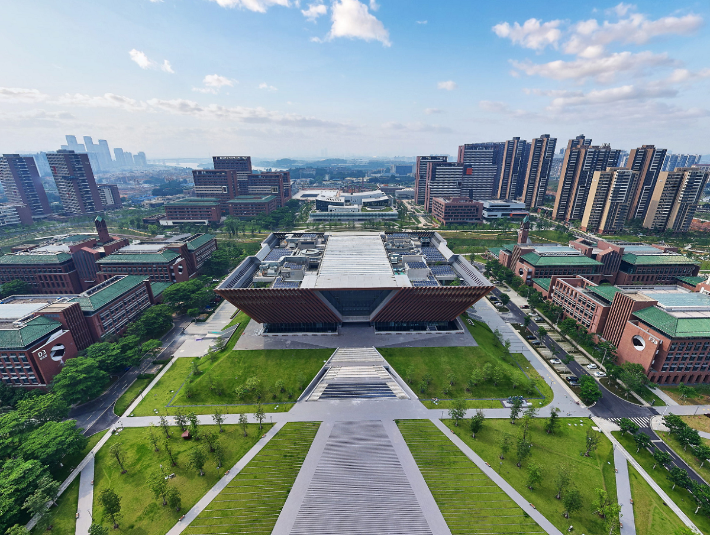

    

        
<strong>Primary contact:</strong> Shidang Xu

        
<strong>Email:</strong> xusd@scut.edu.cn

        
<strong>Phone:</strong> 13717051839

        
<strong>Address:</strong> No. 777, Xingye Avenue, Guangzhou, 510006

        
<strong><a href="https://calendly.com/xushidang" target="_blank">Book an appointment</a></strong>

    

    

        <iframe src="https://www.google.com/maps/embed?pb=!1m18!1m12!1m3!1d3683.938297122623!2d113.4086811!3d23.0101661!2m3!1f0!2f0!3f0!3m2!1i1024!2i768!4f13.1!3m3!1m2!1s0x3403abfa009032d7%3A0xc48aa276ff6bccb0!2z5Lit5Zu95a2m5ZyL5ZOB5biC5bel5YWt5ZOB5qWa6YOo5ZyS!5e0!3m2!1szh-CN!2sus!4v1625240411027!5m2!1szh-CN!2sus" allowfullscreen="" loading="lazy"></iframe>
    

    

